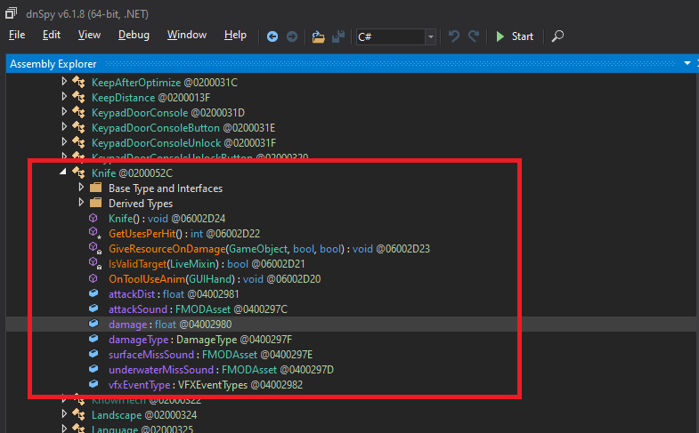

# Exploring the game files

To build our mod, we first need to find out some some useful pieces of information. The goal is to modify the damage inflicted by the knife. Some key questions to answer, then:

1. How do we get hold of the knife "object"?
2. How does the game determine how much damage to apply when the knife strikes a target?

This is where dnSpy comes in.

Fire it up from where you installed it. Once it's running, select `File > Open`, navigate to `<game>\Subnautica_Data\Managed\Assembly-CSharp.dll`.

You should see a bunch of stuff down the left hand side of the screen that might look interesting. What you'll see is a list of `Classes` in green. If you expand one of these, you'll see the class `Methods` in orange and you'll see class `Fields` in purple. It's here where we'll find the answers to our questions above.

dnSpy has some brilliant search functionality, so in the search box at the bottom of the screen, change the `Search for` drop down to `class` and enter the word "Knife" and hit return. You should see a class called `Knife` in the left side of the screen, and you can expand it to see it's `methods` and `fields`:

A couple of things jump out:

1. There's a `damage` field of type float. It's like Christmas has come early, as this looks very much like a value that is used to determine how much damage to inflict on a target!
1. However, remember that we need to "inject" somewhere early in the lifecycle of this object. There is no obvious method, highlighted in orange, for us to "hook" into to alter this value.

At this point it's worth touching on Unity event functions. To keep things simple, you can think of Unity event functions as steps executed in order when an object is created in the Unity game engine. You can find out more in the [Unity documentation](https://docs.unity3d.com/Manual/ExecutionOrder.html).

What's important to take away is that there are some "standard" event functions that always run when a Unity component is instantiated. The key events to look out for are:

- Awake - a method that's run right at the beginning of the component lifecycle.
- OnEnable - a method that's run when a component becomes enabled.
- Start - a method that's run only once when a component starts.

These are great method to hook into for modding, as they typically give you an opportunity to intercept a components behaviour right before the default behaviour kicks in.

As you can see, we don't have any of those methods in our Knife class. So are we stuck?

Not quite. Click on the arrow to the left of "Base Type and Interfaces", under the Knife class. You'll see that the Knife "inherits" behaviour from a class called "PlayerTool". So, double click that:

Now we're talking! We have an `Awake` method, which is something we can intercept in order to change the behaviour of our component right at the point it "comes to life", so to speak. As Knife inherits from PlayerTool, and has a "damage" property for us to tweak, we now have what we need!

Back to our two questions:

1. How do we get hold of the knife "object"? We intercept the "Awake" method on the parent "PlayerTool" class and use that to get a handle on the knife.
2. How does the game determine how much damage to apply when the knife strikes a target? The "damage" property looks very much like it is used in that calculation, and increasing that value will likely do what we want.

Finally, let's write some code!